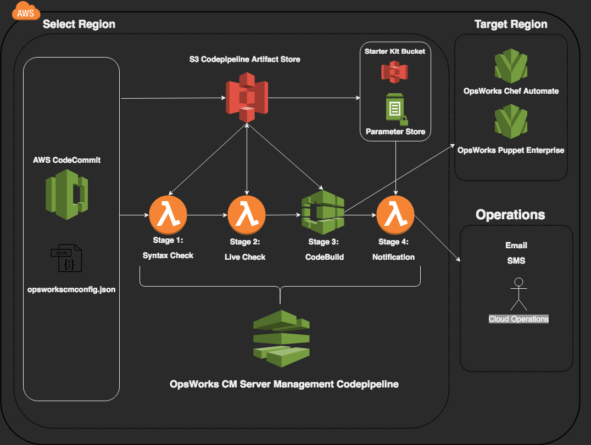

## AWS Opsworkscm Server Mgmt

aws-opsworkscm-server-mgmt sets up a pipeline that manages OpsWorks Configuration Manager server instances (such as OpsWorks Chef Automate and/or OpsWorks Puppet Enterprise) based on a configuration file (opsworkscmconfig.json). The pipeline can identify a "rogue" instances (defined by those instances that does not have an entry in the opsworkscmconfig.json) and optionally remove the instances. The pipeline currently supports single account and multi region for now but the effort is under way to support multi account and multi region instances.


# Solution Architecture




# AWS OpsWorks Chef Automate and AWS OpsWorks Puppet Enterprise

## Operational Considerations:

### OpsWorks Servers
* Runs on EC2 instances that are exposed via the console and CLI
* OpsWorks servers run on the newest versions of Amazon Linux
* Chef Server 12.x
* Chef Automate Server 1.8 - [Release Notes for Chef Automate](https://docs.chef.io/release_notes_chef_automate.html)
* Puppet Enterprise 2017.3

### Chef Client
* minimum supported version of chef-client is 13.x - [Latest Stable Release](https://downloads.chef.io/chef/stable)

### Puppet agent
* Version of supported puppet agent is > 5.3.2- [Component version document of Puppet Enterprise](https://puppet.com/docs/pe/2017.3/overview/component_versions_in_recent_pe_releases.html)

# opsworkscm-server-mgmt pipeline installation/uninstallation instruction

## Prerequisite

* Lambda function zip file must be hosted in a S3 bucket and its name must be specified in the opsworkscm-server-mgmt-pipeline-params.json file, using 'LambdaS3Bucket' parameter key.  For example,
```json
{
  "ParameterKey": "LambdaS3Bucket",
  "ParameterValue": "opsworkscm-lambda-sources-us-east-1"
}
```

* Lambda function zip file's name can be anything but the name must be end with .zip extension and it must be specified in the opsworkscm-server-mgmt-pipeline-params.json file, using 'LambdaS3Key' parameter key.  For example,
```json
{
  "ParameterKey": "LambdaS3Key",
  "ParameterValue": "opsworkscm-server-mgmt-lambdafunctions.zip"
}
```

* If executing the cloudformation from the AWS CLI, the configured profile should be point to the desired target environment.

####NOTE: Please ensure that the bucket that holds the lambda function zip file is in the same region as the pipeline.  This is a known Cloudformation limitation.


## Pipeline Installation
***Prerequisite***:
Please make sure to stage the lambda functions before running the cloudformation template.  The functions neeed to exist in a S3 bucket as a zip file (For example, s3://opsworkscm-lambda-sources-us-east-1/opsworkscm-server-mgmt-lambdafunctions.zip)


if you are not sure how to do that then please leave the LambdaS3Bucket and LambdaS3Key parameters default in the cloudformation parameters file.  If you would like to stage your own lambda function zip file then please modify the LambdaS3Bucket and LambdaS3Key parameters and use the zipupandsend.sh script to "zip up and send" to your own bucket.


***Installation***: In order to deploy the pipeline, please execute the deploy-pipeline.sh script:

```bash
aws cloudformation create-stack --stack-name opsworkscm-stack1 \
  --template-body file://opsworkscm-server-mgmt-pipeline-cfn.yaml \
  --parameters file://opsworkscm-server-mgmt-pipeline-params.json \
  --capabilities CAPABILITY_IAM CAPABILITY_NAMED_IAM
```

## Pipeline Execution
Upon completion of the cloudformation stack deployment, a codecommit repository named "opsworkscm-server-mgmt" is created.

Initially, the opsworkscm-server-mgmt repository is empty to prevent automatically triggering a run of the pipeline. Creating the file "opsworkscmconfig.json" within the opsworkscm-server-mgmt repository is required for a successful execution of the pipeline.

An example of "opsworkscmconfig.json":
```
{
  "ops_delete_if_absent_entry": "False",
  {
    "ops_env": [
      {
        "name": "devinstance1",
        "ops_account": "[YOUR AWS ACCOUNT NUMBER]",
        "ops_region": "[desired region code]",
        "ops_subnet": "[subnet ID of target network]",
        "ops_key_pair_name": "[managed ssh key name]"
      }
    ]
  }
}
```
This will provision OpsWorks Configuration Manager Server in us-east-1 region with the name "devinstance1" (The correct account ID is required)
**See below for more comprehensive list of options and explanation**


## Pipeline Uninstallation
```bash
aws cloudformation delete-stack --stack-name opsworkscm-stack1 
```

## Currently supported configuration parameters
```
{
  "ops_delete_if_absent_entry": "True",
  "ops_env":
  {
    "name": [String],
    "ops_engine": [String],
    "ops_engine_model": [String],
    "ops_engine_version": [Integer],
    "ops_account": [Integer],
    "ops_region": [String],
    "ops_subnet": [string],
    "ops_key_pair_name": [String],
    "ops_instance_type": [String],
    "ops_maintenance_window": [String],
    "ops_use_automated_backup": [Boolean],
    "ops_backup_retention: [Integer],
    "ops_backup_window": [String],
    "ops_delete_if_absent_entry": [Boolean]
  }
}
```
* "ops_delete_if_absent_entry": "True" or "False" (optional)
* "ops_env"{ }: This is used to describe an OWCA Server environment (required)
* "name": Name of the OpsWorks Chef Automate Server Instance (required)
* "ops_engine": Either 'Chef' or 'Puppet' (required and case sensitive)
* "ops_engine_model": 'Single' or 'Monolithic' for OWCA nad OWPE respectively (optional and case sensitive)
* "ops_engine_version": '12' or '2017' for OWCA and OWPE respectively (optional)
* "ops_account": 12 digit AWS Account ID (required)
* "ops_region": Target Deployment Region for OWCA Server (required)
* "ops_subnet": Target Deployment Region Subnet ID (required)
* "ops_key_pair_name": ssh key pair name to allow (optional)
* "ops_instance_type": desired instance type (optional) **See below for a complete list**
* "ops_maintenance_window": desired 1 hour maintenance window **See below for an acceptable string format**
* "ops_backup_window": desired 1 hour backup window  **See below for an acceptable string format**
* "ops_use_automated_backup": True or False (optional)
* "ops_backup_retention": an integer in between 0-30 (do not use quotes)
* "ops_delete_if_absent_entry": This causes the pipeline to delete the OWCA and OWPE instances that are not found in the opsworkscmconfig.json (optional - default False)

### Supported Instance Types for an OWCA Server
* m4.large
* r4.xlarge
* r4.2xlarge

### Supported Instance Types for an OWPE Server
* c4.large
* c4.xlarge
* c4.2xlarge

### Supported format for maintenance and backup window
The supported string format is
* DDD:HH:MM (both for backup and maintenance window to indicate weekly backup and maintenance)
* HH:MM (only for backup window to indicate daily backup)
* Examples:
```text
MON:08:00 (Monday 8AM for one hour)
SUN:01:00 (Sunday 1AM for one hour)
02:00     (2AM daily)
06:00     (6AM daily)
```
Maintenance window is a weekly activity thus providing daily format would be an invalid entry.
Automated backup can be daily or weekly, depending on the user parameters.

## Upcoming Features
The following feature request has been received and will be made available in the subsequent releases:

###Feature Enhancements:

1. Delete OWCA server feature with a control parameter - ops_delete_if_absent (boolean)

2. Ability to deploy the pipeline in other regions (currently only us-east-1 is supported) NOTE: Please be careful to understand that OWCA servers can be provisioned any region that supports opsworks. This is different from the location of the pipeline.

3. Cross account provisioning support.

4. Store install state in an external store like S3 or DynamoDB instead of generating state in a shell script.

5. Provision an ALB (Application Load Balancer) as part of the stack and associate OWCA server's public IP address to the ALB and possibly associate a select CNAME

## License Summary

This sample code is made available under a modified MIT license. See the LICENSE file.
